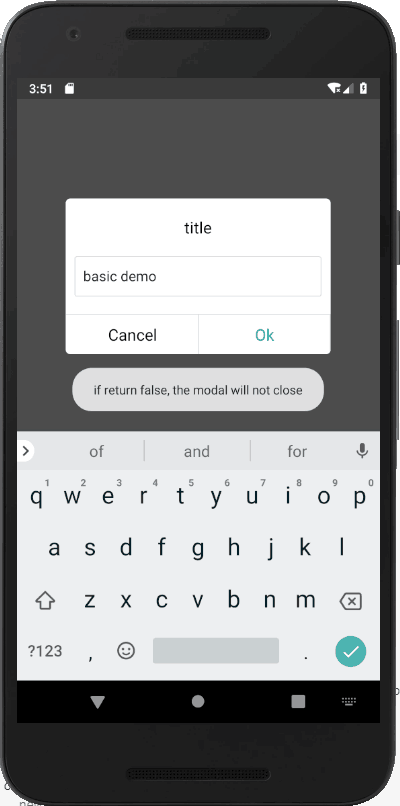
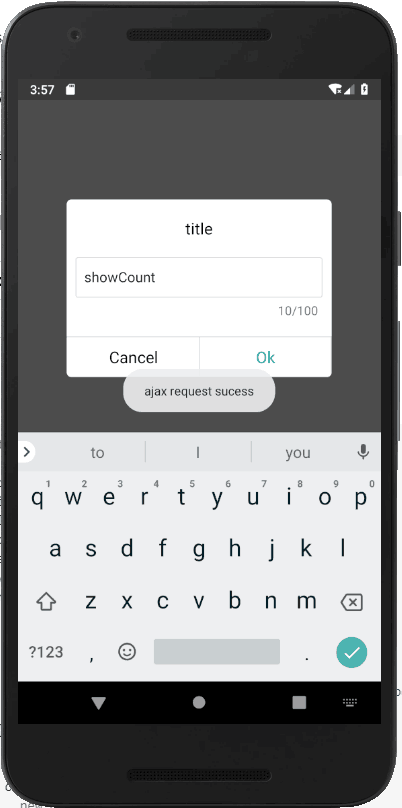

# react-native-modal-prompt

A cross-platform prompt component for React Native.

## Installation

```
$ npm install react-native-modal-prompt --save
```

## Examples

| Basic | Prompt showCount |
| --- | ------- |
|  |  |

## Basic Usage

```js
import Prompt from 'react-native-modal-prompt';

<Prompt
  visible={this.state.promptVisible}
  title="title"
  placeholder="please write something"
  defaultValue="prompt"
  showCount={true}
  operation={[
    { 
      text: 'Cancel',
      color: '#000',
      onPress: () => { 
      ToastAndroid.showWithGravity('if return false, the modal will not close', 1000, ToastAndroid.CENTER);
      return false; 
    }},
    {
      text: 'Ok',
      onPress: (value) =>
        new Promise((resolve) => {
          console.log(`the prompt value is ${value}`);
          // ajax....
          ToastAndroid.showWithGravity('ajax request sucess', 1000, ToastAndroid.CENTER);
          setTimeout(resolve, 2000);
        }),
    },
  ]}
/>
```

full examples [here](./examples/App.js).

## API

Props:

- `visible` (boolean) -- Control display or hiding
- `title` (string, required) -- The title text of the prompt
- `placeholder` (string) -- The placeholder text of the prompt
- `defaultValue` (string) -- The default value of the prompt
- `operation` (array, required) -- Multiple control buttons can be customized, and the 'onPress' function is callback of the button after click that can await something like ajax, if the return value is false, the prompt will not close
- `maxLength` (string) -- The maxLength can be input of the prompt
- `showCount` (boolean) -- If this is true, the prompt will display word length of input


